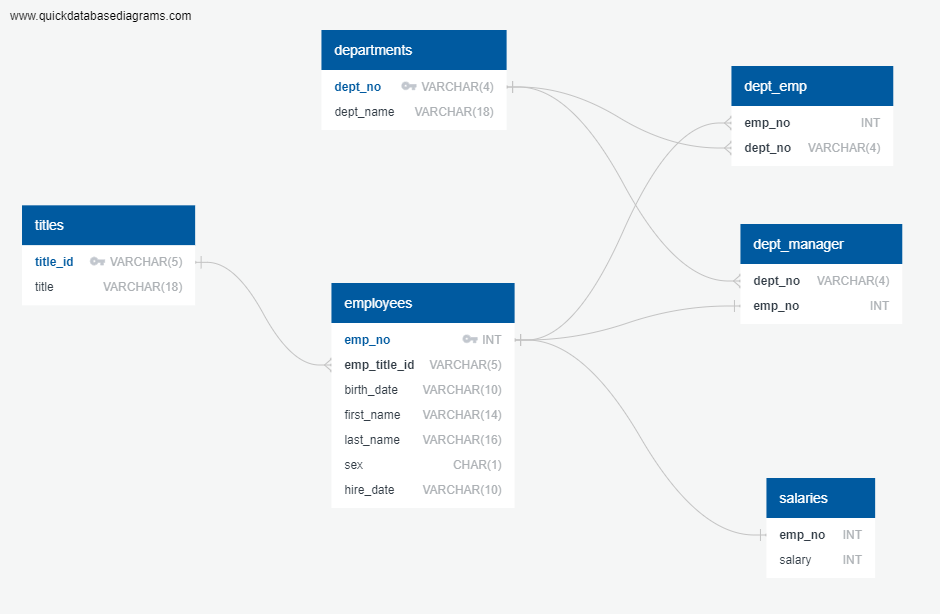

# HR database
## File structure
- `DataExploration.ipynb` is used to load the data from the CSV files in the `data` directory and suggest a data model based on the data and data types. It also includes the code for the diagram generated on https://quickdatabasediagrams.com/
- `table_schemata.sql` includes the schema for the creation of the table and the constraints. Please use the Import function in Postgresql to load the data from the CSV files.
- `data_analysis.sql` contains all the queries used to answer the questions in the assignment.
- `data` (directory) contains all the CSV files used to populate the tables in the database.

## Data model
### ERD
The model depicted below is used for the database.

### Data types
The following choices were made when creating the schema:
- All IDs that are numerical are casted as `INT`.
- All IDs that are non-numerical are casted as `VARCHAR`.
- All salaries are casted as `INT` as they do not have any decimal values.
- Because the employee's sex is a single character, it is casted as `CHAR(1)`
- Dates (birth and hire) are originally casted as `VARCHAR(10)`, in the MDY format and converted to `DATE` using the Postgresql built-in `TO_DATE()` function. More about this in the next subsection.
- All the other columns are non-numerical and therefore casted as `VARCHAR`. The maximum length is calculated in `DataExploration.ipynb` by looking at the longest string in all the columns. This is very constraining as new data with longer string could therefore not be added to the database. For the purpose of this assignment, this constraint is considered viable. In a real-life scenario, the decision would be made to add some margin on the longest string, perhaps allowing strings that are 15% or 20% longer to be used. For instance, `employees.last_name` could be casted as `VARCHAR(20)` instead of `VARCHAR(16)`.

### Dates
We have chosen to convert `birth_date` and `hire_dates` to dates using the `TO_DATE()` within `table_schemata.sql`. This simplifies the manipulation of data in the data analysis and allows the sorting of dates in ascending or descending order. This has two main consequences:
1. Because the data type is now `DATE`, new data would need to be formatted appropriately before being imported.
2. The code as it is in this repo, is different to what it would be should the dates have remained casted as string (see below)

Code to select employees hired in 1986 with `hire_date` casted as `VARCHAR(10)`:

``SELECT first_name, last_name, hire_date FROM employees WHERE hire_date LIKE '%/1986'``

### NOT NULL conditions
Only a handful of columns in the different tables do not include a NOT NULL statement. While the data only includes non-null values, the following fields allow for NULL values:
- `titles.title`: we allow the HR department to define a title that is an empty string. This could be the case for employees that have required a title change or a title that is not yet in the system. It is however preferred to have this defined as "Not applicable" or something similar.
- `employees.sex`: we allow the employee to have no gender specified.
- `salaries.salary`: when a salary is being negotiated, or in the case where an unpaid intern is in the system, a salary could be left blank. A value of 0 could be preferred but if no no-cost invoice or paysheet is issued, a NULL value may be preferred. We do not discuss the morality or legality of this practice in this assigment :)

### Composite keys
The assignment requires primary keys to be set for each table. In the case of tables `dept_emp` and `dept_manager`, repeating values do not allow the creation of a primary key from the existing data. A composite key could be created by joining both column or by creating a `SERIAL` id. Since these tables are used as junction tables, we have elected not to create any additional keys that would not add any value to the data model.

Table `salaries` has a column without repeating value: the employee number. However, since this is used as a foreign key from the primary key in the `employees` table, we have decided to leave it as is and not complicate the data model.

Should the reviewer decide that these tables do need a primary key as well, it can be very quickly implemented.
